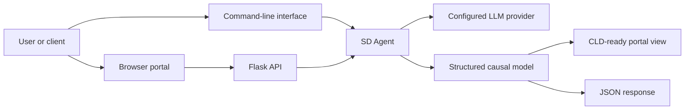

# SD Robo

SD Robo is an AI-assisted System Dynamics modelling framework for causal knowledge discovery with large language models (LLMs). It transforms a natural-language problem statement into a structured causal model that can be rendered as a causal loop diagram (CLD) or consumed as JSON.

At the centre of the framework is **SD Agent**, the modelling engine that identifies a system boundary, variables, causal relationships, feedback loops, time delays, and testable dynamic hypotheses. The generated output is intended to support early-stage model development and should be reviewed by people with relevant domain and System Dynamics expertise before it informs decisions.

This open-source project was developed as part of academic research into AI-assisted System Dynamics modelling. Please cite the project using [CITATION.cff](CITATION.cff) when it contributes to academic work.

## 1. High-Level Design

SD Robo provides three ways to work with SD Agent: a browser portal, a Flask API, and a command-line interface. Each accepts a problem statement and a model alias, then invokes the selected agent version to return a shared, schema-constrained causal model.



The structured response includes:

- `boundary_conditions`: the modelled scope, exclusions, assumptions, and time horizon.
- `variables`: concepts classified as `Stock`, `Flow`, or `Auxiliary`.
- `relationships`: causal links with polarity, delay, confidence, and explanation.
- `loops`: reinforcing (`R`) and balancing (`B`) feedback structures.
- `dynamic_hypotheses`: testable behaviour-over-time hypotheses linked to variables and loops.

### Agent Versions

| Version | Approach | When to use it |
| --- | --- | --- |
| `v1` | Baseline agent that reasons directly from the problem statement and returns a structured model. | Fast exploratory modelling and baseline comparisons. |
| `v2` | Retrieval-augmented (RAG) agent that retrieves relevant local System Dynamics knowledge before producing the same structured model. | Context-aware modelling grounded in the supplied knowledge source. |

`v2` is the default for unversioned portal and API routes. Its retrieval tool selects relevant sections from [src/rag_sources/system_dynamics_knowledge.md](src/rag_sources/system_dynamics_knowledge.md); it does not require a separate vector database or embedding service.

Use explicit versions through `/v1`, `/v2`, or `/api/v1/...` and `/api/v2/...` routes.

## 2. Codebase Overview

```text
sd-robo/
├── src/
│   ├── agents/
│   │   ├── sd_agent_v1.py       Baseline structured-output agent and response schema
│   │   ├── sd_agent_v2.py       Retrieval-augmented SD Agent
│   │   └── model_aliases.py     Provider model aliases and resolution
│   ├── api/app.py               Flask API and portal routes
│   ├── portal/                  Static browser interface for CLD and JSON views
│   ├── rag_sources/             Local knowledge used by the v2 retriever
│   ├── tools/                   Local retrieval-tool implementation
│   └── main.py                  Command-line entry point
├── requirements.txt             Python dependencies
├── CITATION.cff                 Citation metadata
└── LICENSE                      MIT license
```

The API serves the portal and orchestrates calls to SD Agent. The portal displays summaries, CLDs, and structured JSON. Both agent versions share the same Pydantic response schema, so clients can rely on a consistent response shape regardless of the selected version.

## 3. Set Up and Run Locally

### Prerequisites

- Python 3.10 or later.
- An API key for the LLM provider selected at runtime.
- Internet access for the selected LLM provider and the portal's browser libraries, which load from public CDNs.

Node.js is not required.

### Create a Virtual Environment and Install Packages

From the repository root, create and activate a virtual environment, then install the packages listed in [requirements.txt](requirements.txt).

Windows PowerShell:

```powershell
python -m venv .venv
.\.venv\Scripts\Activate.ps1
python -m pip install --upgrade pip
python -m pip install -r requirements.txt
```

macOS or Linux:

```bash
python -m venv .venv
source .venv/bin/activate
python -m pip install --upgrade pip
python -m pip install -r requirements.txt
```

### Configure LLM Provider Credentials

Set the credential for the provider behind the model alias you intend to use. The available aliases are defined in [src/agents/model_aliases.py](src/agents/model_aliases.py).

| Provider | Model aliases | Required environment variable |
| --- | --- | --- |
| OpenAI | `gpt`, `gpt-5.5` | `OPENAI_API_KEY` |
| Anthropic | `claude-f`, `claude`, `claude-o` | `ANTHROPIC_API_KEY` |
| Google, when configured | Provider-specific model string | `GOOGLE_API_KEY` |

For the current terminal session, set the relevant variable before starting the application.

Windows PowerShell:

```powershell
$env:OPENAI_API_KEY = "your-key"
```

macOS or Linux:

```bash
export OPENAI_API_KEY="your-key"
```

To persist the variable on Windows for your user account:

```powershell
[Environment]::SetEnvironmentVariable("OPENAI_API_KEY", "your-key", "User")
```

On macOS or Linux, add the appropriate `export` command to your shell profile, for example `~/.zshrc` or `~/.bashrc`, then open a new terminal. Never commit API keys to the repository.

### Start the Portal and API (Recommended)

From the repository root, run:

```powershell
python src/api/app.py
```

Open <http://localhost:5001> in a browser. The default portal uses `v2`; use <http://localhost:5001/v1> or <http://localhost:5001/v2> to select a version explicitly.

### Run from the Command Line

Invoke the agent directly for local experiments:

```powershell
python src/main.py --query "Housing market dynamics" --model gpt --version v2
```

### Call the API

Send a problem statement and optional model alias as JSON:

```powershell
Invoke-RestMethod `
	-Uri http://localhost:5001/api/v2/sd-agent `
	-Method Post `
	-ContentType "application/json" `
	-Body '{"query":"Housing affordability worsens as rents rise and supply lags.","model":"gpt"}'
```

| Method | Endpoint | Purpose |
| --- | --- | --- |
| `GET` | `/`, `/v1`, `/v2` | Serve the browser portal. |
| `GET` | `/config`, `/api/config`, `/api/{version}/config` | Return available model aliases and agent versions. |
| `POST` | `/sd-agent`, `/api/sd-agent` | Generate a model with the default (`v2`) agent. |
| `POST` | `/api/{version}/sd-agent` | Generate a model with `v1` or `v2`. |

Successful API responses contain the resolved model, agent version, original query, parsed `json` model, and `raw_output`.

## 4. Research and License

SD Robo intentionally limits generated models to a compact set of variables and feedback loops so the results remain legible and useful for CLD development. Generated relationships and hypotheses are modelling suggestions, not validated evidence or decision recommendations.

The original source code developed as part of this research is released under the [MIT License](LICENSE). Third-party libraries, frameworks, datasets, documents, and other materials remain subject to their respective licences and terms of use.